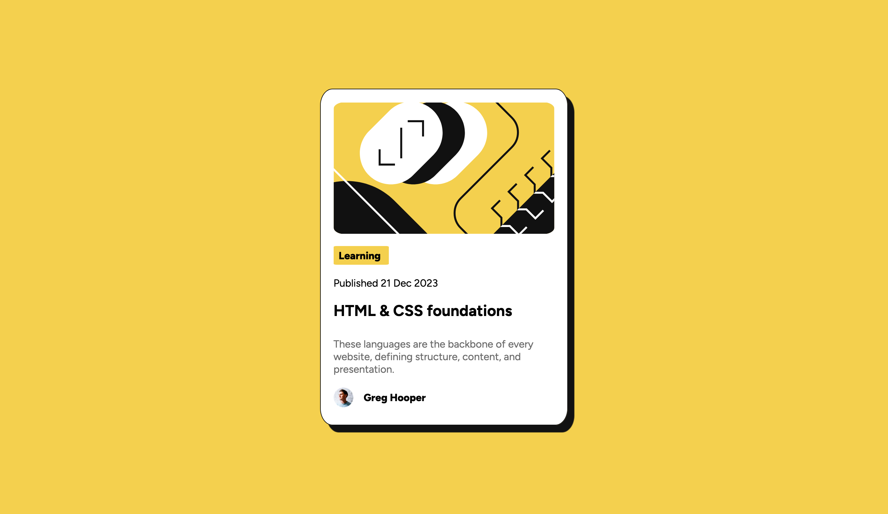

# Frontend Mentor - Blog preview card solution

This is a solution to the [Blog preview card challenge on Frontend Mentor](https://www.frontendmentor.io/challenges/blog-preview-card-ckPaj01IcS). Frontend Mentor challenges help you improve your coding skills by building realistic projects. 

## Table of contents

- [Overview](#overview)
  - [The challenge](#the-challenge)
  - [Screenshot](#screenshot)
  - [Links](#links)
- [My process](#my-process)
  - [Built with](#built-with)
  - [What I learned](#what-i-learned)
  - [Continued development](#continued-development)
  - [Useful resources](#useful-resources)
- [Author](#author)

## Overview

### The challenge

Users should be able to:

- See hover and focus states for all interactive elements on the page

### Screenshot



### Links

- Solution URL: [GitHub](https://github.com/gwencoding/blog-preview-card-main)
- Live Site URL: [Blog-preview-card](https://blog-preview-card-gc.netlify.app/)

## My process

### Built with

- Semantic HTML5 markup
- CSS custom properties
- Flexbox
- Mobile-first workflow

### What I learned

The importance of css layout and the naming in html.

```html
<div class="container">
  <div class="card"> </div>
</div>
```
```css
.container{
  display: flex;
  justify-content: center;
  margin: 10% auto;
  padding: auto;
}
```

### Continued development

Right now, I'm using CSS Flexbox but for future projects I want to use CSS Grid.

### Useful resources

- [CSS Flexbox](https://css-tricks.com/snippets/css/a-guide-to-flexbox/) - This helped me for CSS Flexbos.

## Author

- Frontend Mentor - [@gwencoding](https://www.frontendmentor.io/profile/gwencoding)

